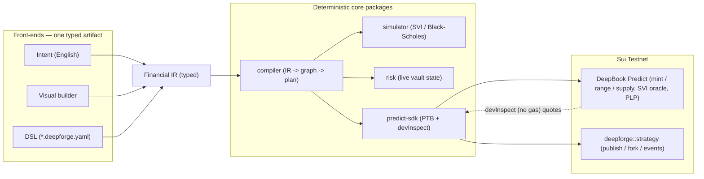

<div align="center">


# DeepForge

**The programming language & development environment for DeepBook Predict.**

`Live on Sui Testnet` · `Compiler + IDE + CLI` · `Forkable on-chain strategies`

</div>

> People don't think in transactions. They think in intent. DeepForge compiles
> intent into programmable financial strategies on DeepBook Predict.

DeepBook Predict (live on Sui testnet) is a vol-surface-priced prediction market:
binary up/down positions, vertical ranges, and a PLP vault. Using it directly
means hand-composing strikes, expiries, SVI pricing, and settlement. DeepForge
raises the altitude: you express a strategy as **intent** (English, a visual
graph, or a YAML file) and it compiles down to validated, simulated, risk-scored,
executable on-chain transactions.

The declarative `*.deepforge.yaml` file is the artifact everything runs from -
written by hand or generated from a prompt - then **`plan`** (dry-run: priced &
simulated) and **`apply`** (executed), exactly like `terraform plan` / `apply`.

```
intent / *.deepforge.yaml
   → strategy graph (DAG)
   → resolve strikes against the live oracle
   → price every leg on-chain (devInspect, no gas)
   → simulate payoff distribution + score risk
   → Programmable Transaction Block → mint / range / supply
   → forkable, versioned on-chain Strategy object
```

## System design

DeepBook Predict is the instruction set; DeepForge is the compiler on top. Three
front-ends lower to one typed Financial IR, a deterministic core prices/simulates/
scores it, and the SDK lands real transactions and mints forkable Strategy objects.



The compile flow — and a fuller architecture diagram, plus ready-to-paste Excalidraw
prompts — live in [`docs/DIAGRAMS.md`](docs/DIAGRAMS.md).

## Live on testnet - nothing mocked

- Reads live oracles + the SVI volatility surface, and **prices trades via
  `devInspect`** against the real Predict contract.
- Executes real `predict::mint` / `mint_range` / `supply` transactions
  (confirmed `RangeMinted` on testnet from the web app).
- Compiled strategies mint a forkable `deepforge::strategy` object (package
  published to testnet) that shows up in the marketplace and can be forked.
- Every number traces to a real source: cost = on-chain `devInspect`; the payoff
  distribution = the protocol's own SVI price function; risk = live vault state.

## Run it

```bash
pnpm install
pnpm -r --filter "./packages/*" build
pnpm test                              # unit tests
(cd move/deepforge && sui move test)   # Move tests
```

**Web app** (intent → compile → simulate → deploy → publish → fork):
```bash
pnpm --filter @deepforge/web dev       # http://localhost:5173
```

**CLI** (the Terraform-style driver):
```bash
node apps/cli/dist/cli.js plan    examples/btc-range.deepforge.yaml   # dry-run, no gas
node apps/cli/dist/cli.js apply   examples/btc-range.deepforge.yaml   # execute on testnet
node apps/cli/dist/cli.js publish examples/btc-range.deepforge.yaml   # mint Strategy object
```

## What you need for live execution

- **Testnet SUI** for gas (faucet.sui.io). Gas is paid in SUI, not dUSDC.
- **dUSDC** for deploys - request via the DeepBook Predict testnet token form.
- **A key-based wallet** (seed phrase). zkLogin/Google accounts in Slush can fail
  to sign; a passphrase account or the CLI signs reliably.
- **`OPENROUTER_API_KEY`** for the English-intent mode only. See `.env.example`.

The compiler, simulator, and risk engine are deterministic - the LLM only turns
English into the typed strategy file; all financial logic is code.

## Docs & pitch

- [`docs/PRESENTATION.md`](docs/PRESENTATION.md) - slide-by-slide deck content, a
  6-minute live demo script covering every feature, and a judge Q&A cheat-sheet.
- [`docs/DEMO.md`](docs/DEMO.md) - the original demo walkthrough.
- [`docs/DIAGRAMS.md`](docs/DIAGRAMS.md) - system architecture + compile-flow
  diagrams (Mermaid + Excalidraw AI prompts) for the deck and README.
- [`docs/brand/`](docs/brand) - 1:1 project logo (submission-ready PNG).
